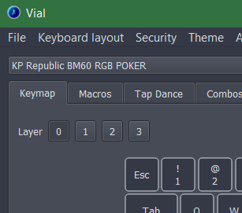
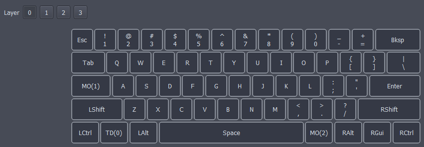
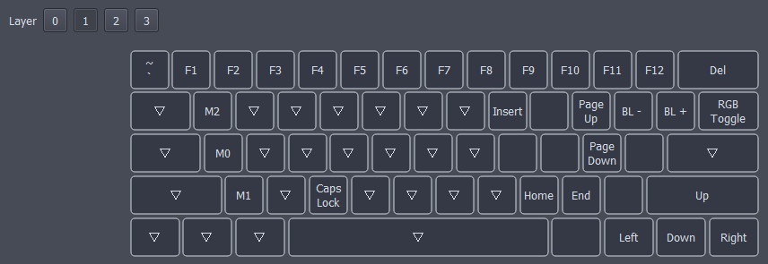

# Layers
layers allow the ability to change the functionality of the entire keyboard based on what "layer" it's currently on. It's best to visualize layers stacked on top of each other. Most Vial devices have 4 layers but the firmware can be compiled to have less. Keys can be configured to switch between layers as needed similar to function keys on a laptop.

You can view each layer available by clicking the coresponding number at the top of the interface. You can see we already have layer 0 selected.

A typical layer setup would include a "base" layer and a "Function" layer. 

#### Base Layer

#### Function Layer

You can see additional key functionality is located on the "Function" layer. This is just convention, in realality you can do whatever you want with the layers.

# Moving Between Layers
Switching between what layer is active can be done in a few ways. In the lower palette, select the **layer** tab to view all the different options. 

- MO(layer)  - momentarily activates the layer. As soon as you let go of the key, the layer is deactivated.
- DF(layer) - changes which layer is the default layer. This stays until the device loses power.
- TG(layer) - toggles the layer, activating it if it's inactive and vice versa.
- TT(layer) - If you hold the key down, the layer is activated, and then is de-activated when you let go (like MO). If you repeatedly tap it, the layer will be toggled on or off (like TG). It needs 5 taps to do this.
- OSL(layer) - momentarily activates the layer until the next key is pressed.
- LT layer (kc) - momentarily activates the layer when it is held, sends a keycode when pressed. The keycode can be defined like all the other buttons, Just select the smaller box inside.

# Additional Information on Layers

### Transparency
The Triangle symbols represent Transparency. Those mean the action is the same as the layer below it. This is useful so that keys from different layers can be pressed at the same time. 